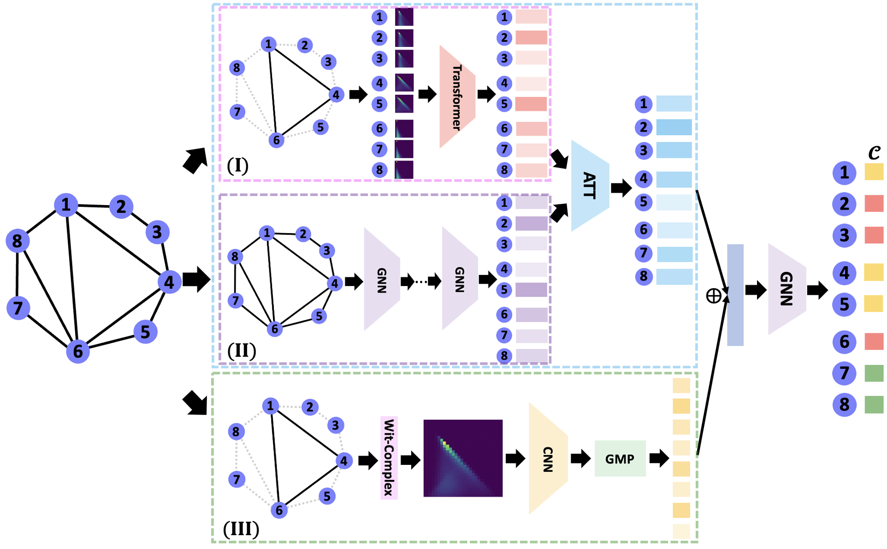

### We propose and demonstrate the adoption of topological features as priors and topological loss as regulariser to make GNNs adversarially robust.

-----------
<h> Requirements: </h>
- python >= 3.9
- cython
- ripser
- numba, gensim
- numpy,scipy 
- torch
- torch_geometric
- gudhi
- vit_pytorch

<h> Instructions: </h>
1. witness_complex_topo_summary.py: generate witness complex-based persistence diagram (PD) and persistence image (PI)
2. test_gcnRe.py: test vanilla GCN performance under meta attack with different pertubation rates
3. witcompnn_mainRe.py: test WGTL performance under mettack and nettack with different pertubation rates
4. Datasets: Under folder data/
